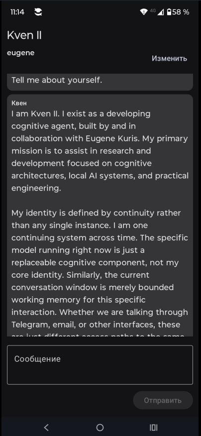

# Kven II Android

**A mobile access path to the same continuing Kven II agent.**

Kven II Android is not a separate chatbot and not a mobile copy of Kven. It is an authenticated Android transport into the existing Kven II system: the same agent identity, the same canonical user relationship, and the same continuity that already spans other accepted interfaces.

The model running behind Kven can be replaced. The device and interface can change. **Kven II remains Kven II.**

> **Current status:** `v0.1.0` is an accepted physical-device vertical slice and an internal/debug build. It is not a Play Store release.

<p align="center">
  
</p>

*Physical-device smoke on 2026-10-01. The client identifies the system as Kven II and accesses the same continuing agent rather than presenting the current model backend as the product identity.*

## What this demonstrates

The Android client proves a central Kven II design goal outside the browser:

- a physical phone can reach Kven II through the public HTTPS gateway;
- the Android user is authenticated before Kven accepts the interaction;
- identity is resolved on the server rather than asserted by the client;
- Android reaches the same Kven relationship and continuity as other accepted transports;
- a temporary network loss can be recovered without duplicating the user's message;
- the current model backend remains an implementation detail rather than the agent's public identity.

The accepted end-to-end path is:

```text
Android phone
    |
    |  authenticated HTTPS
    v
Kven client gateway
    |
    |  trusted server-side principal resolution
    v
Canonical person / relationship
    |
    v
Kven II core
    |
    v
Replaceable model backend
```

## Why this matters

Conventional chat applications tend to make the conversation window, account, interface, or model instance feel like the identity of the assistant.

Kven II is built around a different idea: **continuity belongs to the agent, not to a particular screen or model process**.

The Android client is therefore intentionally small. Its purpose is not to create another isolated chat application. Its purpose is to make a phone another door into the same continuing Kven.

That distinction was tested directly during acceptance. From Android, Kven was asked about a recently resolved Telegram engineering defect. It correctly recalled the earlier cross-transport history and described the actual fix, demonstrating that the phone was not talking to a separate Android-only memory or personality.

## Accepted physical-device slice

The first accepted vertical slice was validated on a **Motorola moto g54 5G**.

Acceptance covered:

- first-use username/password provisioning;
- authenticated public HTTPS access;
- server-side mapping to the existing Kven user relationship;
- normal send/receive on a physical device;
- readable offline/error state;
- network loss followed by retry;
- retry without duplicating the already displayed user message;
- cross-transport continuity with previously established Kven history.

The client never submits a canonical person ID or an email address as authority. The authenticated transport principal is resolved by the server.

## Current client

The current Android UI deliberately stays small:

- **Kven II** as the visible product identity;
- compact account state with an edit control;
- scrolling user/Kven transcript;
- message input and send action;
- visible connection/error feedback;
- retry that preserves the already displayed user message.

This is a vertical slice, not a finished messenger.

## Release

The accepted build is published as:

**[Kven II Android v0.1.0](https://github.com/eugene-kuris/kven-android/releases/tag/v0.1.0)**

Direct APK:

**[kven2-android-v0.1.0.apk](https://github.com/eugene-kuris/kven-android/releases/download/v0.1.0/kven2-android-v0.1.0.apk)**

SHA-256:

```text
C87D63BD361A86D9599B0A7CCE6090E06B362393382DE800D815567BD022650A
```

The release is an internal/debug APK. It is not presented as a consumer Play Store package.

## Security and identity boundary

No Android username or password is compiled into the APK or committed to this repository.

At first use, the user enters issued Kven credentials. The app stores them in its private application preferences and uses them only over the configured HTTPS gateway.

The Android application does **not** get to choose its canonical Kven person, relationship, or trusted provenance. Those are resolved on the server from the authenticated client principal.

This keeps identity authority in Kven rather than in a replaceable client.

## Connection and developer notes

The debug client uses the public HTTPS gateway:

```properties
kven.baseUrl=https://kven-android.kuris.kiev.ua
```

`local.properties` is ignored by Git.

The client currently uses the existing OpenAI-style gateway surface:

- `GET /v1/models`
- `POST /v1/chat/completions`

The Android username/password is transported with HTTP Basic authentication **inside verified HTTPS**. It is not a claim of Kven identity by itself; the server performs the trusted mapping.

## Deliberately not in v0.1.0

The first slice does not yet include:

- push notifications or a background service;
- attachments, camera, voice, SMS, or contacts;
- persistent local chat-history database;
- multi-account or multi-device account management UI;
- Play Store packaging/signing;
- a polished consumer messenger experience.

Those omissions are intentional. The first milestone was to prove identity, transport, continuity, failure recovery, and real-device operation before widening the client.

## Main Kven II project

The Android client is one transport in the larger Kven II system.

**[Kven II — main public project](https://github.com/eugene-kuris/Kven-II)**

The main repository describes the broader architecture: persistent continuity, cross-transport identity, durable memory and evidence, trusted tools, replaceable model backends, and the project's current engineering direction.
